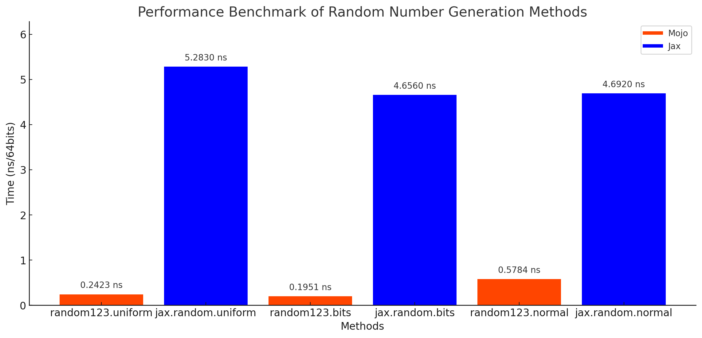

# Random123

Random123 is a library of *splittable* pseudo random number generators. It follows [Jax's PRGN design](https://jax.readthedocs.io/en/latest/jep/263-prng.html).

# Usage

```mojo
import random123
from random123 import PRNGKey

var key = random123.key(123)
var samples = random123.normal[DType.float32](key^, 1000)

fn f(owned key: PRNGKey):
    var newkey: PRNGKey
    var subkey: PRNGKey
    newkey, subkey = random123.split(key^, 2)
    g(newkey^)
    h(subkey^)
```

Implemented methods include `bits`, `uniform` and `normal`. More to come!

Note that it is required to use the transfer operator `^` whenever using a `PRNGKey`, and `split` it into new keys if needed.
Otherwise, you should make sure every key is only used once.

# Benchmarks

Random123 is blazingly fast, thanks to the buildin SIMD vectors and `parallelize` in Mojo.
Here is a comparison with Jax:




# Heads-up

You might bump into a compiler bug with `DType.float16` or `DType.bfloat16`. 
See the [issue](https://github.com/modularml/mojo/issues/3073#issue).
